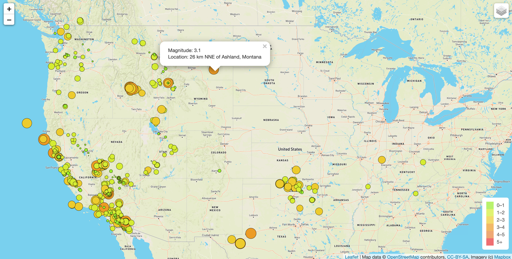

# mapping-earthquakes

# Table of Contents 
  - [Resources](#resources)
  - [Data](#data)
  - [Results](#results)
   - [Overview](#overview)
  
### Resources

Software: visual studio code, Javascript, Python, D3, Leaflet, Mapbox API 

### Data
Data for this project is gathered from https://earthquake.usgs.gov/earthquakes/feed/v1.0/summary/all_week.geojson and https://raw.githubusercontent.com/fraxen/tectonicplates/master/GeoJSON/PB2002_boundaries.json

### Overview  
The goal of this project was to create an interactive global map that shows up to date earthquake information from the previous 7 days. A popup marker is generated for each earthquake. The size and color of the marker correspond to the magnitude of the earthquake. There is also a tectonic plate overlay. Mapbox API and Leaflet javascript library combine to create the map. It is able to be viewed locally using a python http.server. 

